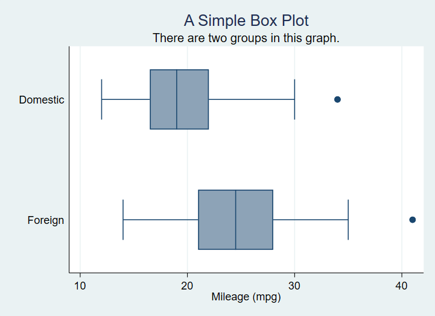

# The basic `graph` command and some simple examples

The most basic command for creating graphs and charts in Stata is `graph`. This command has a number of sub-commands and options. The major sub-commands describe different varieties of plot - such as twoway, box plot, and the sub-types of twoway such as scatter and line. For some reason there is also a small collection of graphs that are independent of either `graph` or `twoway` including `histogram`.

Our first example graph is a box plot of a numeric variable. The examples use the built-in `auto` dataset.

    library(Statamarkdown)

    sysuse auto
    histogram mpg

This simple graph has no options specified. We begin by specifying a Title.

    sysuse auto

    graph box mpg, ///
      title("A Simple Box Plot")

    sysuse auto

    graph box mpg, title("A Simple Box Plot") ///
      subtitle("There is only one group in this graph.") ///
      note("In later graphs we will subset the data.")

No we subset the data using the categorical variable `foreign`.

    graph box mpg, title("A Simple Box Plot") ///
      subtitle("There is only one group in this graph.") ///
      over(foreign)

Which produces[^1]

[^1]: Remember to distinguish **by()** which repeats a command over subsets of data and **over()** which performs on action on subsets of data.

We can switch to horizontal boxes with

    sysuse auto, clear

    graph hbox mpg, ///
     title("A Simple Box Plot") ///
      subtitle("There are two groups in this graph.") ///
      over(foreign)

Now we will use color to distinguish the groups. It is important to note that the option `asyvars` causes Stata to treat the groups as seperate ***y variables***.

    graph box mpg, ///
        title("A Simple Box Plot") ///
      subtitle("There is only one group in this graph.") ///
      over(foreign) ///
      asyvars

This gives us

Most of the options introduced so far for the `box` plot type will apply equally to `bar` plots as well.
